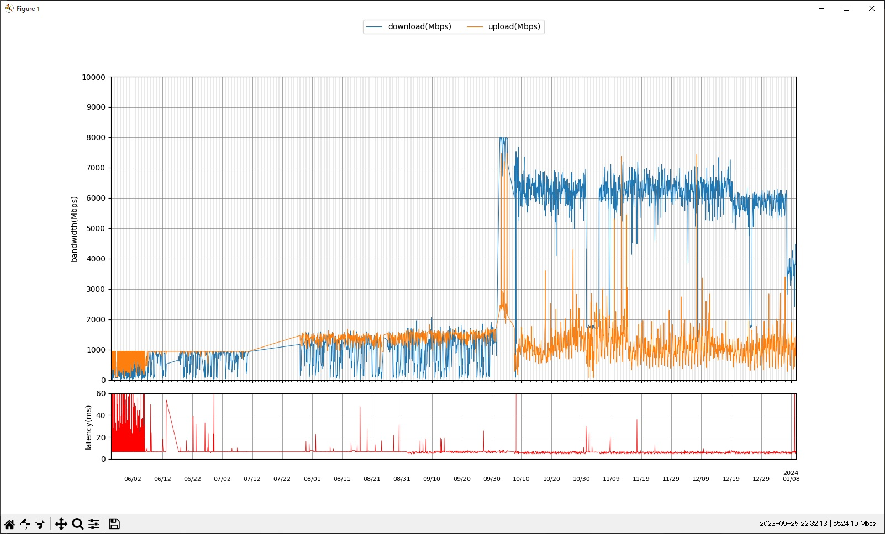

py-speedtest-plot
=================

speedtest-cliの結果をmatplotlibでグラフにするだけ。Python 3.10で確認



準備
-----------------

`speedtest --format=json --progress=no` を1つのログファイルの書きだすことでJSONLファイルにできるのでそれをグラフに出す仕組みになっている。

なので、グラフにするログを集める必要がある。ここではcrontabで仕込む例。


### speedtest-cliを導入する

https://www.speedtest.net/apps/cli

speedtest-cliの動作確認

```bash
# 近いサーバ一覧を取得
speedtest -L

# 計測
speedtest 

# ServerのIDを指定して計測
speedtest -s 21569
```

### crontabの設定

サーバによって計測できるスループットに大きく差があり、10Gbpsを想定していないサーバもある。デフォルトだと単純に近いサーバ（応答が早いサーバかも？）を選ぶため、常に同じサーバが選ばれるわけではない。これだと結果にバラつきがでてしまう。

そのためいくつか計測してみて良さそうなサーバを3つほど選んでおく。3つ理由はサーバはたまに通信がうまくいかないこともあったり、そもそもサーバが消えることもある。
計測はちゃんと残しておきたいといった目的から3つ選んで置き、先頭から使う形にする。もし異常が起きれば単純に2番目のサーバIDで記録されるので、除外も容易である。

もちろん計測できないことがあってもよいなら1つでもいい。

今回は `21569 14623 50686` を使うものとする。

```vasg
# サーバIDは適宜書き換え
SERVER_ID_LIST="21569 14623 50686"

# 2時間毎に計測
4 */2 * * * for ID in $SERVER_ID_LIST; do speedtest -s $ID --format=json --progress=no >> /var/log/speedtest/speedtest-$(date +\%Y\%m\%d).jsonl |& logger -t speedtest && break; done
```

cronで定期的に実行する際のログを格納するディレクトリを作成（cronを誰で実行するかに応じて所有者や権限をつける）

``` bash
mkdir /var/log/speedtest/
```

`/var/log/speedtest/speedtest*.jsonl` に実行ログが溜まっていくので、これを本プログラムでグラフにする。（1日あたり10KBぐらい）

実行
-----

ログは logs に配置する。

``` python
python -m venv venv
. venv/Scripts/activate
pip install -r requirements.txt

python main.py
```

matplotlibのGUIで描画される。また画像は`graph.png`で出力される。


### メモ

speedtestの正常終了時は標準エラー出力が出ないようなので、`logger -t speedtest`に転送している部分はお好みの通知プログラムに投げても良さそう。

以下はそれぞれ標準エラー出力の例。

サーバ側が応答できないとき。

```
{"type":"log","timestamp":"2023-09-13T15:01:08Z","message":"Error: [0] Timeout occurred in connect.","level":"error"}
```

サーバIDの指定を間違えたとき。指定していたサーバIDのサーバが無くなった場合も該当。

```
{"type":"log","timestamp":"2023-09-14T09:01:03Z","message":"Configuration - No servers defined (NoServersException)","level":"error"}
```

名前解決ができないとき。インターネットが繋がらない時など。

```
[2023-10-02 02:01:06.527] [error] Trying to get interface information on non-initialized socket.
[2023-10-02 02:01:11.533] [error] Configuration - Couldn't resolve host name (HostNotFoundException)
[2023-10-02 02:01:11.533] [error] Configuration - Cannot retrieve configuration document (0)
[2023-10-02 02:01:11.538] [error] ConfigurationError - Could not retrieve or read configuration (Configuration)
[2023-10-02 02:01:11.538] [error] ConfigurationError - Could not retrieve or read configuration (Configuration)
```
